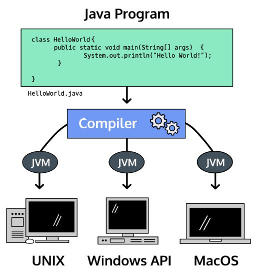
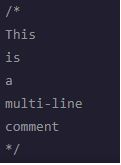

<!--https://www.codecademy.com/learn/learn-java-->

# Entry 1: Introduction

## What is Java?
Java is a programming language and computing platform developed by James Gosling at Sun Microsystems and it was released in 1995. Java is used in most applications and websites and  known to be fast, secure, and reliable. The main reason why people use and love Java is because Java can be run on many different operating systems and platforms due to its Java Virtual Machine.

*A compiler is a program that translates programming languages, in this case Java, into other programming languages (byte code) that is then executed by the Java Virtual Machine (JVM) on your computer. To learn more about compilers check the compiler/compilation section. 

## Java Basics
- Java files have `.java` extension. That mean when making a java file it has to end with `.java` (For ex. `HelloWorld.java`). Notice that the file name uses camel case. Note that when naming anything in Java always use camel case.
- `String[] args` is a placeholder (that’s the idea for now more on that later).
- `System.out.println()` is used to print a message to the screen on a new line. Note that to print a string you must use double quotes.
- To comment a single line code use `//`.

- To comment multi-line code use `/*` and `*/` where you begin with `/*` and end with `*/`.

- You must end every statement in Java with a semicolon (`;`).

## Compiler/Compilation
- The compiler is important because it checks for mistakes in your code before it transforms the code and the computer runs the code.
- To compile a Java file use the terminal command `javac FileName.java`. If the compilation was successful then a `.class` file would be produced (For example if a file `HelloWorld.java` is compiled and it was successful then a `HelloWorld.class` file would be produced). On the other hand, if the compilation of a file is not successful then a list of errors would occur and a `.class` file would not be produced until the errors are fixed and the compile command is run again in the terminal.
- After a file is successfully compiled you can then execute the file by using the command `java FileName` in the terminal.
## Takeaway
During my initial research about Java I had explored multiple sources that teaches Java. At first, I used Youtube to learn Java but most of the speakers of the videos that I found had an accent so it was hard for me to understand them. I looked at another source called [GeeksforGeeks](https://www.geeksforgeeks.org/java-how-to-start-learning-java/) but I couldn’t understand the materials on the website. Therefore I kept looking until I found that Codecademy teaches Java. I looked at it and as always I found the concepts and materials on Codecademy easy to understand. From this, I learned that it’s important to look at multiple sources especially if you find a source that you don’t understand. Don’t try so hard and waste your time to understand something that you just can’t understand. Go search for another source that’s easier to understand.