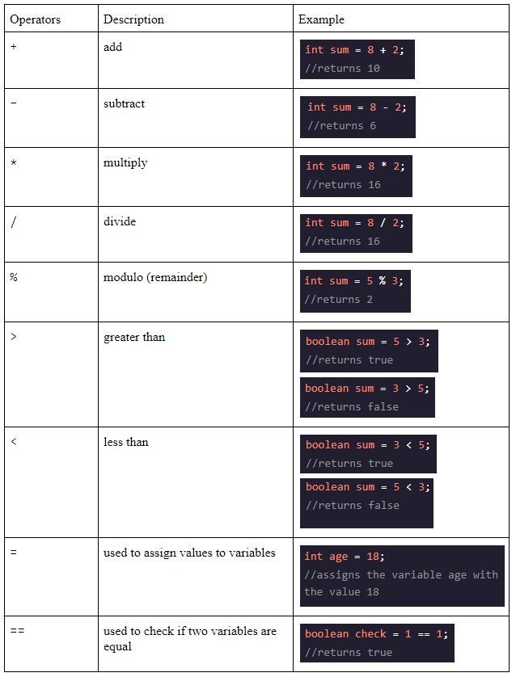

# Entry 2: Variables and Manipulating Variables

## Java Variables
When declaring a variable you always have to start with a primitive data type which are types of data built-in to the Java system. For example when creating a variable that is equal to an integer you have to call the data type which is `int` before the variable name.

There are many other primitive data types such as `double`, `boolean`, and `char`. (For more information on primitive data types look at the table below.)

## String
A `String` is not a primitive data type but like a primitive you declare the variable by specifying the type first. For example:

*Because strings are objects in Java you capitalize the s. Also notice that you have to use double quotes for the string value.

## Static Checking
In Java there is something called static typing which check for errors in the code before compiling a file.

## Naming Variables
* When naming variables it's best to use names that make sense or easy to understand since it makes your code clear, readable, and maintainable.
* Also when naming variables in Java you can only begin the name of a variable with a valid letter, or a `$`, or an `_`. 
* Java variables are case sensitive meaning that you have to use the camelCase method to name variables.

## Java Operators

## `.equals()` Method
The `.equals()` method is used to check if two strings are the same. For example:

## String Concatenation
* You can use the `+` operator to concatenate strings or join two strings together. For example:

* You can also concatenate a string with a primitive data type such as an integer. For example:

## Takeaways
* When learning Java on Codecademy I encountered a lot of errors and many of them are syntax errors. The reason is because in Java you need a semicolon after almost every single line of code therefore it’s easy to miss one semicolon or two and cause an error in your code which could be difficult to find especially if you’re working on a program with a lot of code. As a result, I found it really beneficial to read the error messages which tells me exactly where the error has occurred in my code. 
* While learning Java I have also found it helpful to type out the code especially those common built in Java methods such as `System.out.println()` and `.equal()` so you can memorize them faster.
* Another takeaway that I had while learning Java this week is that take notes while you learn. First of all, taking notes while you learn really helps you remember the materials and get the ideas down. You can be reading something first and then take notes but most of the time you would’ve already forgotten most of what you’ve read. Therefore, taking notes while you read can really help you get the main points down. Also, it’s easier when working on your blog entry. Since you have already completed your notes while you are learning you can just copy and paste your notes into your blog entry.
