<!--https://www.codecademy.com/learn/learn-java-->
<!--https://www.geeksforgeeks.org/classes-objects-java/-->
<!--https://www.geeksforgeeks.org/access-specifiers-for-classes-or-interfaces-in-java/-->
<!--https://www.tutorialspoint.com/java/java_access_modifiers.htm-->

# Entry 3: Introduction to Classes and Methods

This week I planned on completing the Java courses on Codecademy and I did. From the last three lessons on Codecademy I learned about Java classes, methods, conditionals and control flow. Unfortunately, I did not complete my notes. I completed most of my notes except for notes on Java conditionals and control follow which I will definitely complete by next week.

## Java Classes

### Introduction to Classes

A class in java is a blueprint from which objects are created. For example, we can create a `Car` class and use the `Car` class to create many instances or objects of the `Car` class. There are many components to creating a class. The first step of creating a class is setting an access level modifier (Refer to the access level modifier table below for more details. The next step is calling `class` and the class name which should begin with a capitalized letter. Finally, you set the scope or body of the class in between the curly brackets (`{}`). Below is an example of how a class is defined: 

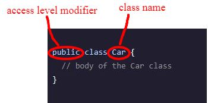

There are more steps in creating a class such as including a superclass and interface, however they can be left out if they’re not necessary to the class you’re creating.

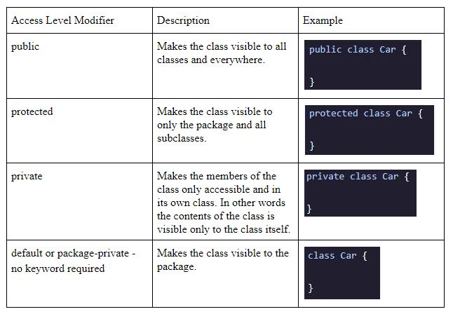

### `main()` Method

Within a class there should always be a `main()` method. The `main()` method lists the tasks performed by the program. Below is an example of the `main()` method within a class.

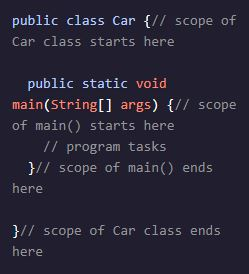

### Constructors

To create an instance of a class we need a constructor method defined within a class. For example:

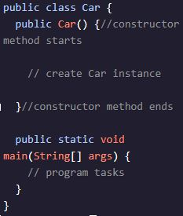

*Note that the constructor method shares a name with the class.

Then we need to call the constructor method within the main method. For example:

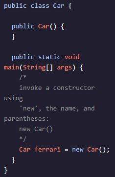

*Note that the `new` keyword must be used when creating a new instance or else an error would occur.

### Instance Field

Instance fields are the state in objects. State, also known as attributes, reflect the properties of an object. We declare the instance field within a class like this: 

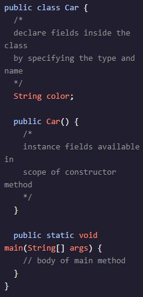

### Constructor Parameters
To create instances with individual state or value you must create constructor parameters and set the parameter value to the instance field. For example: 

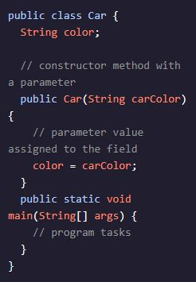

*Note that you must assign a primitive data type to the parameter. 

### Assigning Values to Instance Fields

After the constructor parameter is created and set to the instance field, you can create an instance within the main method by calling the constructor method with an argument. For example:

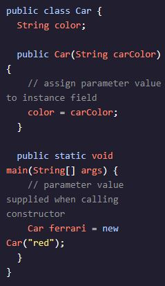

The instance ferrari is created with its color instance given the value “red”. It’s important that the type of the value given to the invocation must match the type declared by the parameter. We can access the value of the instance field by using the dot operator. For example:

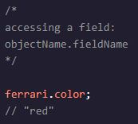

### Multiple Instance Fields

Guess what? You can have multiple instance fields within a class and the constructor method can have multiple parameters to receive values for multiple instance fields! For example:

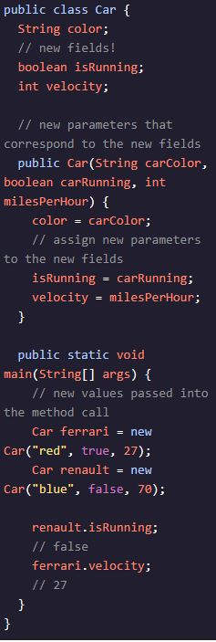

*Something important to note when having multiple instance fields is that you must pass values into the constructor invocation in the same order that they’re listed in the parameter. 

## Java Methods

### Defining Methods

When defining a method you first set the access level modifier which should match the one of the class. For example if the modifier of the class is public then the modifier of the methods should also be public. Next, if the method has an output you must declare the primitive data type of the output or if it does not have an output you need to use the `void` keyword. Then you give the method name using camelcase and end the name with an open and close parentheses `()` where parameters can be stored in between. Finally, you set the body of the class in between the curly brackets (`{}`). Below is an example of how a method is declared.

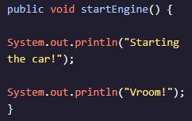

### Calling Methods

To call a method you must first create an instance and then call the method on the instance. For example:

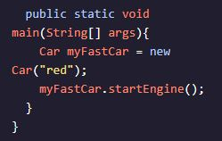

*Something important to note is that a variable declared within a method can not be accessed outside the scope of the method. However, we may use a value from the method if we return it from the method using the keyword `return`. Also methods can be used to reassign values to instance fields.

### `toString()` Method

The `toString()` method is used to return a string that will print when an instance or object is printed.

## Takeaway
A takeaway that I have this week is that after completing my notes I realized that I have taken a lot of unnecessary notes which is why in the end I don’t have the time to complete my notes. I need to learn to take notes on what is necessary and not on what is unnecessary. Also I realized that some of my screenshot are a bit blurry so I need to find a way to fix that for my next blog. 
