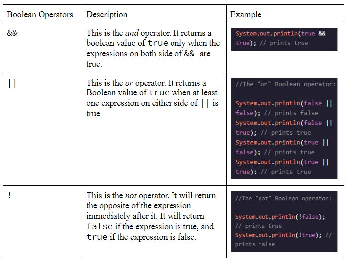

# Entry 4: Java Conditionals and Control Flow
This week I reviewed Java conditionals and control flow on Codecademy and completed my notes on them. I also further explored Java control flows on Udemy and did some practice coding.

## Java Conditionals


## Boolean Operator Precedence
The Boolean operator precedence is the order in which boolean operators are evaluated. For example, the not (`!`) operator is evaluated first, the and (`&&`) operator is evaluated second, and the or(`||`) operator is evaluated last.

## If-Elseif-Else Statements
The `if`, `if`/`else`, and `if`/`else if`/`else` statements are used to conditionally execute blocks of code. You may just use the `if` statement or the `if`/`else` statement if you have just one or two conditionals. You don’t have to use all three of the `if`/`else if`/`else` statements. Also, you may use as many of the `else if` statements as you need. For example:

```
if (true) {
    System.out.println("Access granted.");
}
```

```
if (8 <= 7) {
    System.out.println("Try again...");
} else {
    System.out.println("Success!");
}
```

```
int round = 5;
if (round > 12) {
    System.out.println("The match is over!");
} else if (round > 0) {
    System.out.println("The match is underway!");
} else {
    System.out.println("The boxing match hasn't started yet.");
}
```

[Click here to see a code example on repl.it](https://repl.it/@JohnsonWu/ifelse-ifelse-statement-code-along-practice)

## Ternary Conditional
Ternary Conditional is a shortcut to write `if`/`else` statements in a single line of code. A ternary conditional has three parts. The first part is the Boolean expression. The second part is a statement that gets executed if the Boolean expression is true. The third part is a statement that executed if the Boolean expression is false. For example:

```
int fuelLevel = 3;
char canDrive = (fuelLevel > 0) ? 'Y' : 'N';
System.out.println(canDrive);
```

In the code above `(fuelLevel > 0)` is the boolean expression. If the expression is true `Y` will be printed, but it the expression is false `N` will be printed.

## Switch Statement
The switch statement is used to check the equality of a variable or expression with a value that does not need to be a boolean. For example:

```
char penaltyKick = 'L';
switch (penaltyKick) {
    case 'L': 
        System.out.println("Messi shoots to the left and scores!");
        break; 
    case 'R': 
        System.out.println("Messi shoots to the right and misses the goal!");
		break;
	case 'C':
	    System.out.println("Messi shoots down the center, but the keeper blocks it!");
	    break;
	default:
	    System.out.println("Messi is in position...");
		break;
}
```

*In the code example above the switch statement checks for the value of the `penaltyKick` variable. If the value of the `penaltyKick` variable equals to `L` then the block of code for case `L` will be executed. Likewise if `penaltyKick` equals to `R` or `C`, the block of code for case `R` or case `C` will be executed. However, if the `penaltyKick` does not equal to any of the case values then the `default` block of code will be executed. It's important to note that after each case statement there must be a keyword `break` or else your program will end up in a loop and you will not get the correct value that you want.

[Click here to see a code example on repl.it](https://repl.it/@JohnsonWu/switch-statement-code-along-practice)

## Takeaway(s)
I honestly feel that code snippets are much better than screenshots for creating the blog entries (Thanks for the advise Mr. Mueller!). With code snippets I don't have download all the screenshots that I've taken and upload them onto c9 and then using markdown syntax to display the images on my blog entry. That is a lot of work and errors may occur in between the tedious process. Also, code snippets are much clearer than screenshot. In my previous blog entry, I have stated that the screenshots of my code examples are a bit blurry. However, now with code snippets I am able to see my code examples for clearly.
