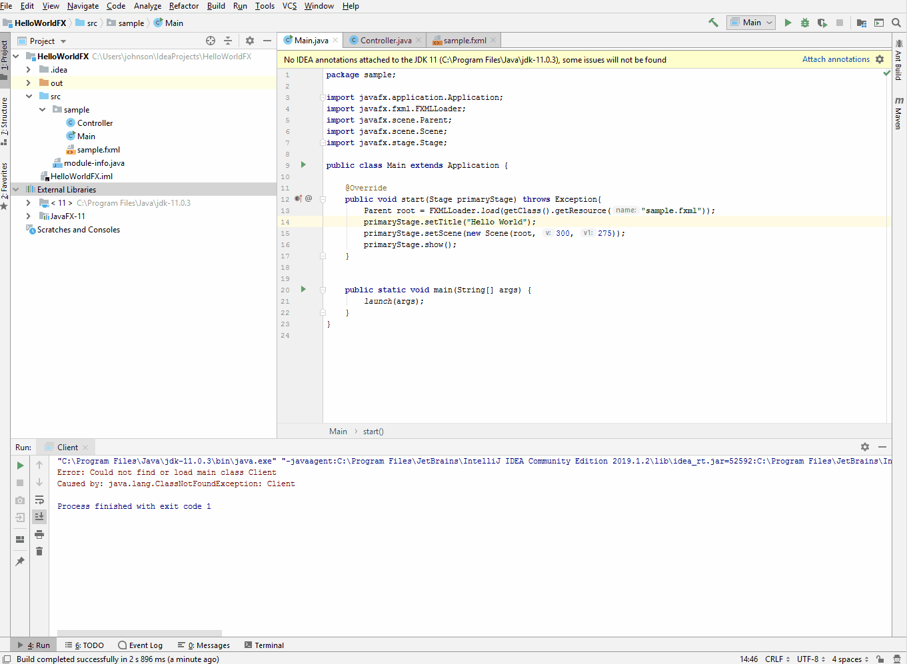
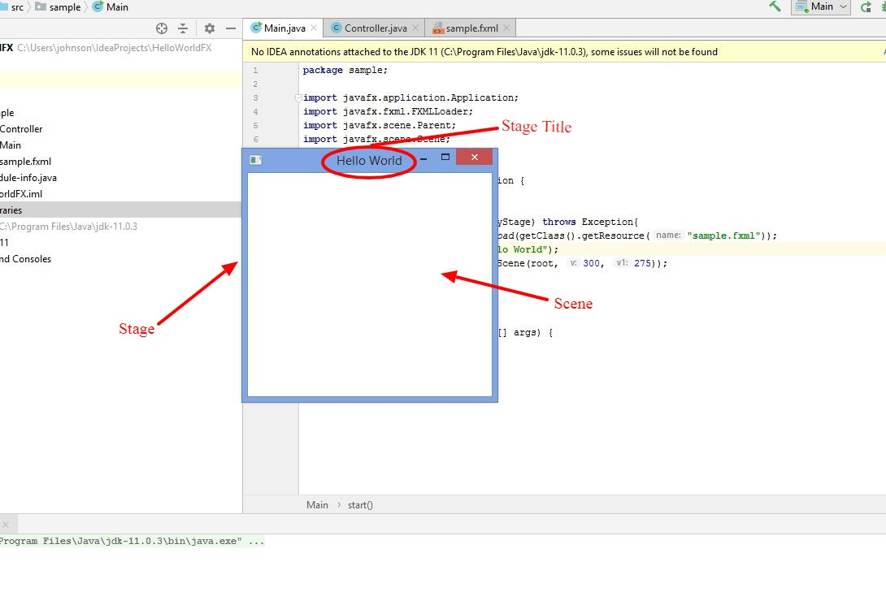
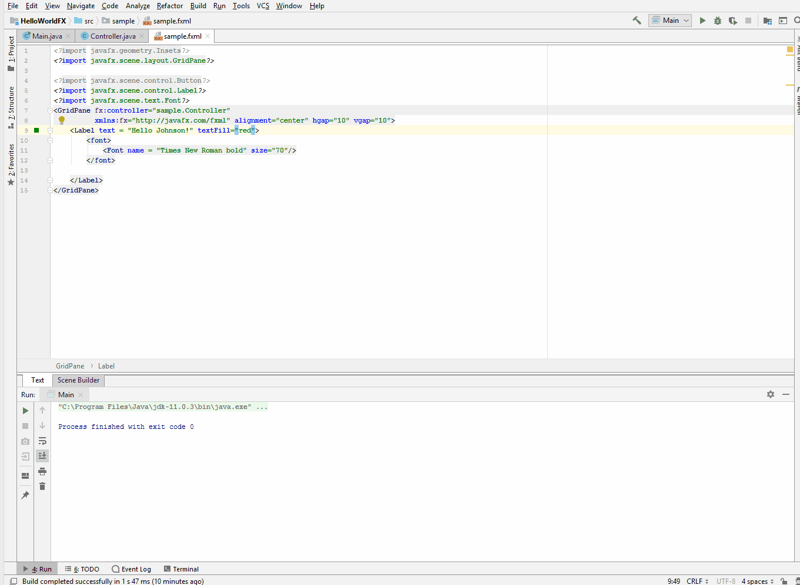
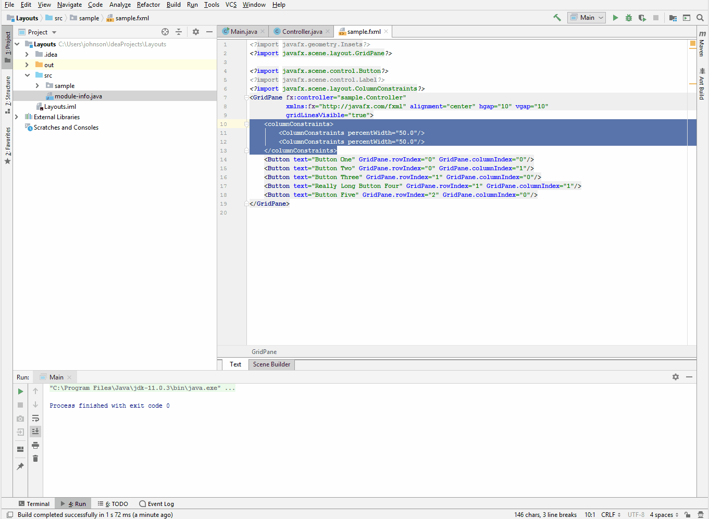

# Entry 6: JavaFX

This week I explored JavaFX and created some sample JavaFX applications.

## What is JavaFX?
JavaFX is a set of api’s or Java packages used to build user interfaces (UI) in Java. JavaFX is used to develop the UI for desktop applications, internet applications, and mobile devices. JavaFX follows the Model-View-Controller (MVC) pattern, which keeps the code that handles the application's data, which is the model, separate from the UI code or the view. The controller is the middleman between the UI and the data, and what it essentially does is that it handles events or determines what happens when the user interacts with the UI. 

## JavaFX Application Setup

So for every JavaFX application, there is a Controller, Main, and sample.fxml file. The Controller is the controller of the MVC, the Main is the model, and the sample.fxml is the view. In the Main file (see code below) there’s a lot of complex code and I will explain it to the best of my understanding. First of all, the `Main` class extends to or is the subclass of the `Application` superclass. In JavaFX there always must be a class, in this case it was the `Main` class, that extends to the `Application` class. The reason is because the `Application` class manages the lifecycle of a JavaFX application or in other words we want the int, start and stop methods from the `Application` class. In the code below you can see that the `start` method which is coming from the `Application` class is called and it’s being override. The reason is because the `start` method is an abstract method in the `Application` class. In the `start` method, the code is basically creating a UI using or following a theater analogy. As you can see in the `start` method there is a `Stage` parameter which is a top level JavaFX container or a main window or you can think of it as a stage in a theater. Next is the line of code that say `Parent root = FXMLLoader.load(getClass().getResource("sample.fxml"));` which basically loads the UI from the fxml file. Following that are the lines of codes that says `primaryStage.setTitle("Hello World");`/`primaryStage.setScene(new Scene(root, 300, 275));` which sets the title of the stage and create a scene with specified width, height and contents. Finally, the line of code that says `primaryStage.show();` essentially displays the stage to the user.

```java
package sample;

import javafx.application.Application;
import javafx.fxml.FXMLLoader;
import javafx.scene.Parent;
import javafx.scene.Scene;
import javafx.stage.Stage;

public class Main extends Application {

    @Override
    public void start(Stage primaryStage) throws Exception{
        Parent root = FXMLLoader.load(getClass().getResource("sample.fxml"));
        primaryStage.setTitle("Hello World");
        primaryStage.setScene(new Scene(root, 300, 275));
        primaryStage.show();
    }


    public static void main(String[] args) {
        launch(args);
    }
}
```

When you run the Main.java file, this is what happens:





Below are some sample JavaFX applications that I worked on this week:





## Takeaway(s)

A takeaway that I have this week that it’s okay if you don’t understand everything. While I was exploring JavaFX this week I came across several challenging concepts and code that I don’t understand. Therefore, I spend hours googling and trying to understand those material. However, when I found some of the answers, I realized that it was not really important to what I was learning or want to make. As a result, from this lesson I learned that it’s okay to not understand and skip a challenging concept, cause in the end you might find it to be not useful. 


