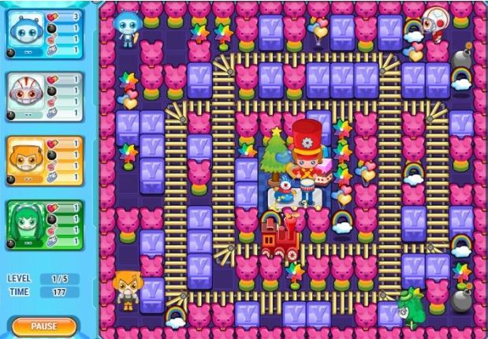
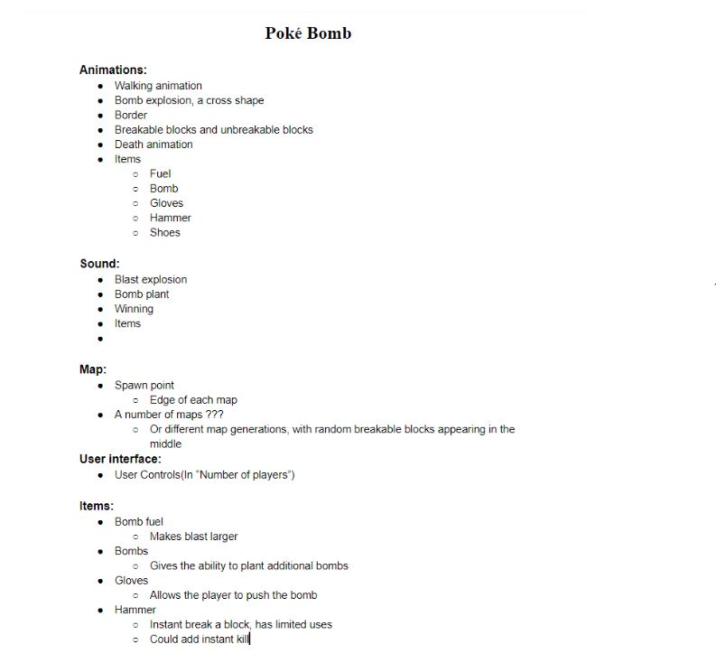
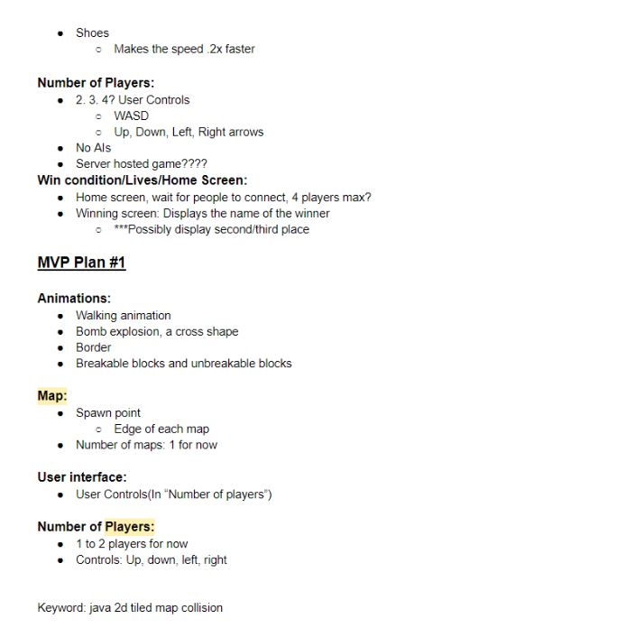
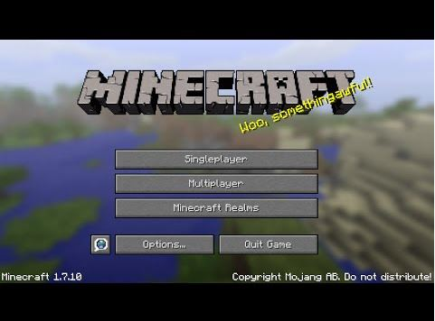
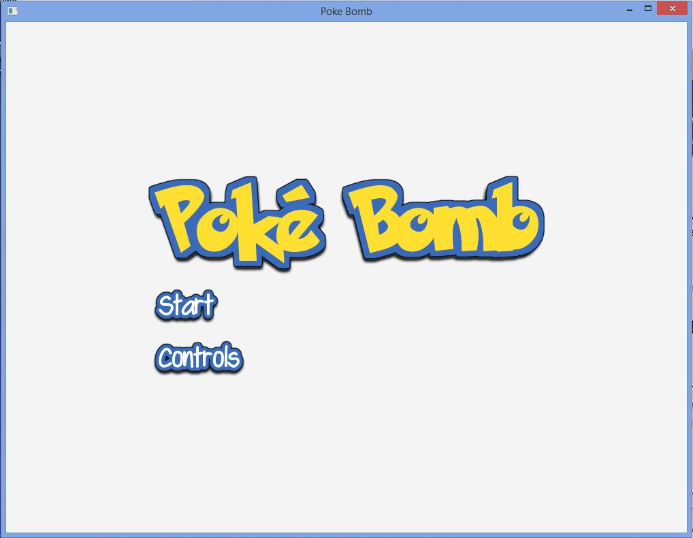
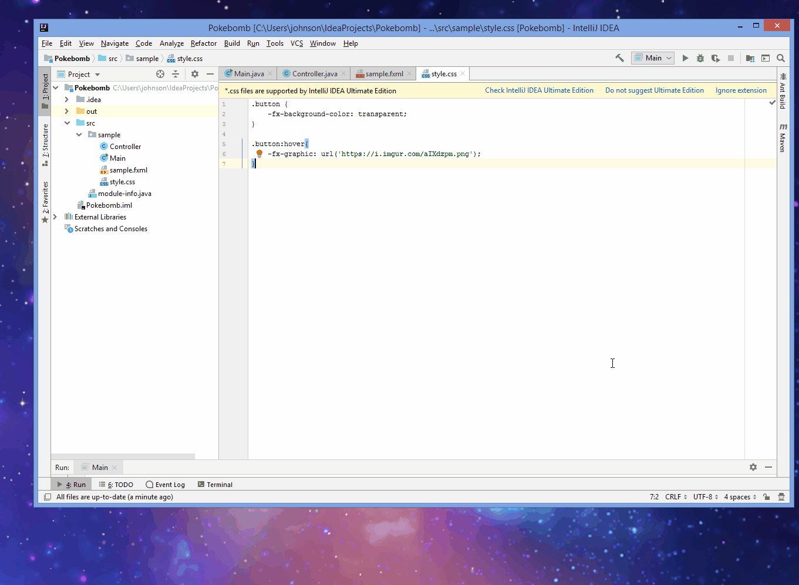
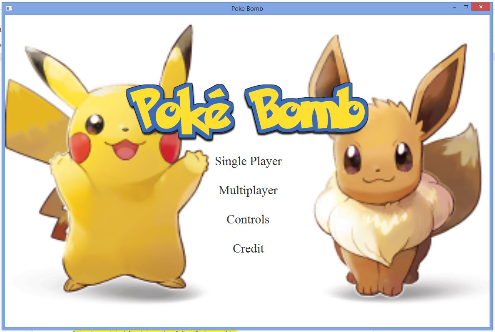
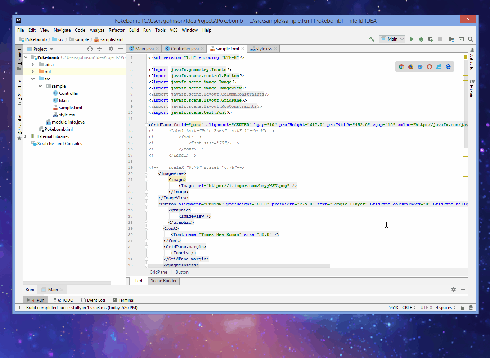
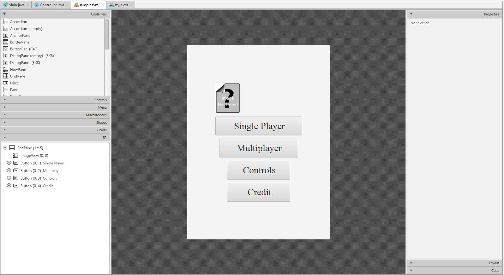

# Entry 7: Planning for the Final Project and Creating a MVP

This week my partners and I started planning for our final project which is creating a game using Java. So far we have planned and started creating a MVP of a our game. Currently, I am working on creating the UI of the start scene of the game. 

## Game Description

What my partners and I decided to make for our final project is a game we named PokeBomb. Based on the name of our game, you would possibly guess that our game is related to Pokemon. If so, you are right! Our game is actually a combination of Pokemon and a game called Bomb It. Bomb It is a single or multiplayer game that look like this: 



To know more about the game and how the game is played below is a link to a video about the game and a link to the game itself.

[Link to Video](https://www.bilibili.com/video/av3792893/)
[Link to Game](http://www.4399.com/flash/196590_3.htm)

For our game we decided to make it to be mostly Pokemon themed with items, maps, and characters from Pokemon, however, the game play will be similar to Bomb It. Below is an image and a link to our game planning doc: 





[Link to PokeBomb Planning Doc](https://docs.google.com/document/d/1FkZmvCxW0ewc0OyTeUV9uCWh07AGpgM9zgYQKbXDO_E/edit?usp=sharing)

## What Have I Been Working on This Week?

This week, I explored more of JavaFX and tried to create the start scene of a game using JavaFX. The start scene of a game look something like the this:



I have created something similar to that but using the fxml file in JavaFX. While I was creating the start scene I had a lot of difficulties as I am still unfamiliar with JavaFX. I had looked at many tutorials and websites to assist me in creating the start scene. However, I have found that many of my searches were useful due to various reasons. For example, many of the tutorials that I’ve looked at uses a different integrated development environment (IDE) that I was using so it made it hard to follow the tutorials. Also some of the tutorials and websites that I’ve found are for Swing users, which is a different graphical user interface (GUI). Though I had many difficulties, I did manage to find some helpful resources. One of the most helpful resources that I’ve found this week is Java Scene Builder. Before I discovered Java it took me more than 3 hours to create what I have below:






```java
<?import javafx.geometry.Insets?>
<?import javafx.scene.layout.GridPane?>

<?import javafx.scene.control.Button?>
<?import javafx.scene.control.Label?>

<?import javafx.scene.text.Font?>
<?import javafx.scene.image.ImageView?>
<?import javafx.scene.image.Image?>
<GridPane fx:controller="sample.Controller"
          xmlns:fx="http://javafx.com/fxml" alignment="CENTER" hgap="10" vgap="10">
    <ImageView>
        <image>
            <Image url="https://i.imgur.com/bmyyW3K.png"></Image>
        </image>
    </ImageView>
    <Button GridPane.rowIndex="1" GridPane.columnIndex="0">
        <graphic>
            <ImageView>
                <image>
                    <Image url="https://i.imgur.com/NhfcJCQ.png"></Image>
                </image>
            </ImageView>
        </graphic>
    </Button>
    <Button fx:id="button" GridPane.rowIndex="2" GridPane.columnIndex="0">
        <graphic>
            <ImageView>
                <image>
                    <Image url="https://i.imgur.com/58oHZ3e.png"></Image>
                </image>
            </ImageView>
        </graphic>
    </Button>
</GridPane>
```

```css
.button {
    -fx-background-color: transparent;
}

.button:hover{
    -fx-graphic: url('https://i.imgur.com/aIXdzpm.png');
}
```

However, after I learned about Scene Builder and looked at some tutorials on it, I was able to design a better start scene in less than an hour. Below is the start scene that I've made with Scene Builder.







```java
<?xml version="1.0" encoding="UTF-8"?>

<?import javafx.geometry.Insets?>
<?import javafx.scene.control.Button?>
<?import javafx.scene.image.Image?>
<?import javafx.scene.image.ImageView?>
<?import javafx.scene.layout.ColumnConstraints?>
<?import javafx.scene.layout.GridPane?>
<?import javafx.scene.layout.RowConstraints?>
<?import javafx.scene.text.Font?>

<GridPane fx:id="pane" alignment="CENTER" hgap="10" prefHeight="617.0" prefWidth="452.0" vgap="10" xmlns="http://javafx.com/javafx/8.0.172-ea" xmlns:fx="http://javafx.com/fxml/1" fx:controller="sample.Controller">
    <ImageView>
        <image>
            <Image url="https://i.imgur.com/bmyyW3K.png" />
        </image>
    </ImageView>
    <Button alignment="CENTER" prefHeight="60.0" prefWidth="275.0" text="Single Player" GridPane.columnIndex="0" GridPane.halignment="CENTER" GridPane.rowIndex="1">
        <graphic>
            <ImageView />
        </graphic>
      <font>
         <Font name="Times New Roman" size="30.0" />
      </font>
      <GridPane.margin>
         <Insets />
      </GridPane.margin>
      <opaqueInsets>
         <Insets />
      </opaqueInsets>
    </Button>
    <Button fx:id="button" alignment="CENTER" prefHeight="60.0" prefWidth="250.0" text="Multiplayer" GridPane.columnIndex="0" GridPane.halignment="CENTER" GridPane.rowIndex="2">
        <graphic>
            <ImageView />
        </graphic>
      <font>
         <Font name="Times New Roman" size="30.0" />
      </font>
    </Button>
   <Button fx:id="button1" alignment="CENTER" layoutX="108.0" layoutY="261.0" prefHeight="60.0" prefWidth="200.0" text="Controls" GridPane.halignment="CENTER" GridPane.rowIndex="3">
      <graphic>
         <ImageView />
      </graphic>
      <font>
         <Font name="Times New Roman" size="30.0" />
      </font>
   </Button>
   <Button fx:id="button11" alignment="CENTER" layoutX="166.0" layoutY="379.0" prefHeight="60.0" prefWidth="200.0" text="Credit" GridPane.halignment="CENTER" GridPane.rowIndex="4">
      <graphic>
         <ImageView />
      </graphic>
      <font>
         <Font name="Times New Roman" size="30.0" />
      </font>
   </Button>
</GridPane>
```

```css
.button {
    -fx-background-color: transparent;
}

.button:hover{
    -fx-font-style: italic;
    -fx-font-size: 30;
}

#pane{
    -fx-background-image: url("https://images.alphacoders.com/923/thumb-350-923543.png");
    -fx-background-size: cover;
    -fx-background-position: center;

}
```

## Takeaway(s)

One takeaway that I have this week is that it’s important to search by using keywords because this way you can get more specific search results. For example, this week I’ve searched “how to create responsive buttons in java” and I got many results that I don’t need such as informations for Swing users. However, when I type keywords to my searches such as “how to make responsive buttons in **JavaFX**” or “how to make responsive buttons in **fxml files**” I got more specific results that I need. Also it’s important to look at all if not most of your searches since you might find some useful information (that was how I found Scene Builder). 
