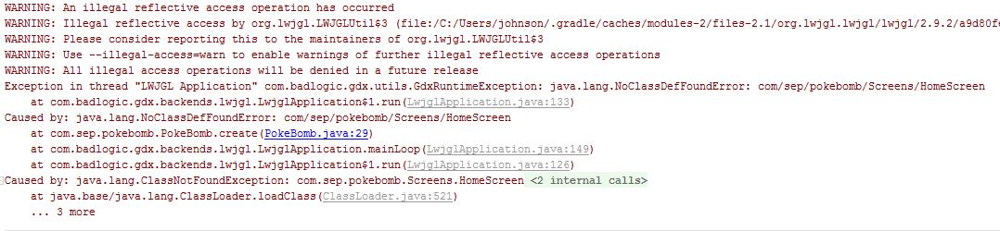
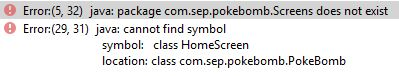
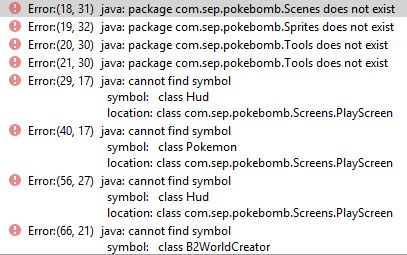

# Entry 8: Combining the Project, Exploring libGDX, Fixing Errors

This week I tried to combine the start scene that I’ve made last week with the game itself that my partners have worked on, however I’ve made little to none accomplishments. I’ve spent days trying to combine the start scene and the game and has even asked google for help, yet I found nothing helpful. In the end I figured that the issue could possibly be because I created the start scene out of JavaFX whereas my partners created the actual game using libGDX. Therefore, I moved on to exploring libGDX and tried to create a new start scene out of it. 

## Exploring libGDX

Since there is only two weeks left to work on the project, I decided to just look up tutorials on how to create a start scene of a game using libGDX and luckily I found one on StackOverflow which had given me basically all the code. However, it was still much more difficult than I’ve thought it would be. I’ve spent hours trying to understand the code and trying it out but all I came across were errors.

After numerous attempts of trying to fix the errors, I realized that I was only creating more errors. Therefore, I decided to retry what I’ve done initially which is combining the start scene that I’ve made last week with the game, but still I made no progress. In the end I got nothing to work and was not even close to creating an MVP. 

## Takeaway(s)

A takeaway that I have this week is that effective communication is very important when working as a team. The reason I say that is not because my partners are bad. They are actually doing more and much better than I am. However, I just feet that we are not communicating well enough and that we are all working independently and not collaboratively. The reason I believe is causing the issue is because we all have different schedules, and we couldn't find a java coding plaform where we could collaborate. 