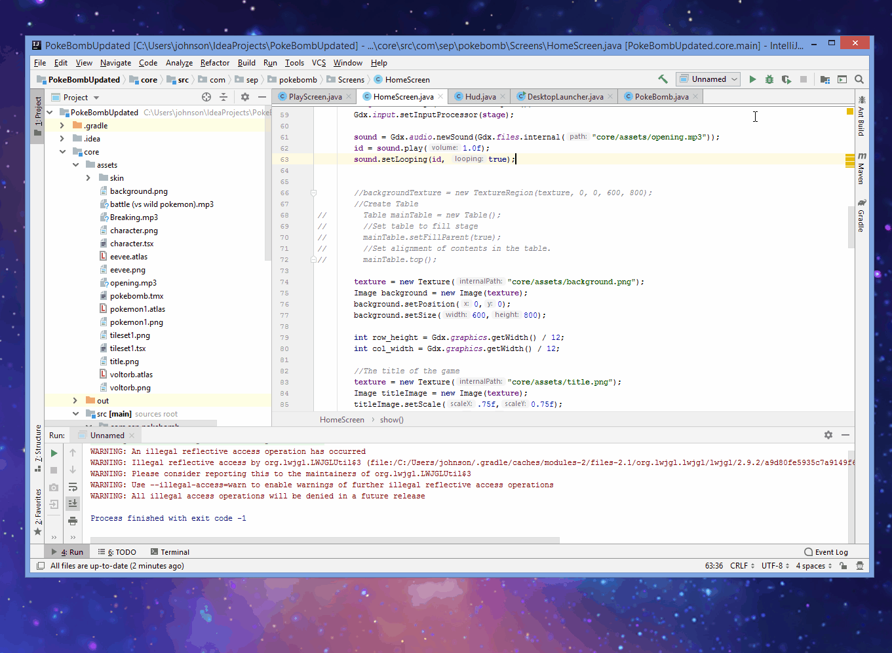
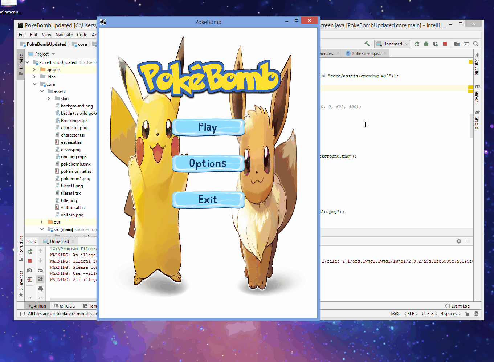
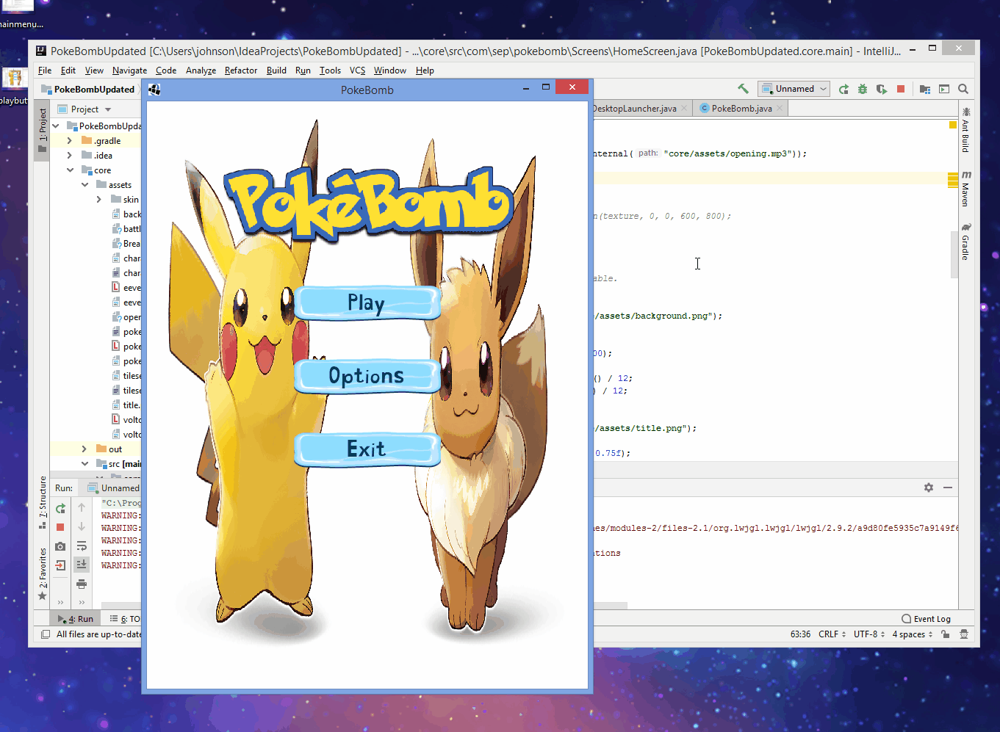

# Entry 9: Finalizing the Project

During this last week of my independent study, I finally figured out how to create a start scene or a home screen using LibGDX. After creating the home screen I also made the buttons on the home screen function as well as added background music to the home screen and game screen. 

## Creating the Home Screen Using LibGDX

Last week I spent the entire time trying the figure out how to create a home screen of a game using LibGDX so that I can create a home screen for the game that my partners and I are working on. However, I made no progress. I was constantly facing errors that I don’t understand and had to search on google for help but I found nothing helpful. Luckily this week after many trials and errors I was finally able to create the home screen. Below is the code and demo gif of the home screen that I created with LibGDX.



```java
package com.sep.pokebomb.Screens;

import com.badlogic.gdx.Game;
import com.badlogic.gdx.Gdx;
import com.badlogic.gdx.Screen;
import com.badlogic.gdx.audio.Sound;
import com.badlogic.gdx.graphics.GL20;
import com.badlogic.gdx.graphics.OrthographicCamera;
import com.badlogic.gdx.graphics.Texture;
import com.badlogic.gdx.graphics.g2d.SpriteBatch;
import com.badlogic.gdx.graphics.g2d.TextureAtlas;
import com.badlogic.gdx.scenes.scene2d.InputEvent;
import com.badlogic.gdx.scenes.scene2d.Stage;
import com.badlogic.gdx.scenes.scene2d.ui.Image;
import com.badlogic.gdx.scenes.scene2d.ui.Skin;
import com.badlogic.gdx.scenes.scene2d.ui.TextButton;
import com.badlogic.gdx.scenes.scene2d.utils.ClickListener;
import com.badlogic.gdx.utils.viewport.ScreenViewport;
import com.badlogic.gdx.utils.viewport.Viewport;
import com.sep.pokebomb.PokeBomb;

public class HomeScreen implements Screen {

    private PokeBomb game;
    private SpriteBatch batch;
    protected Stage stage;
    private Viewport viewport;
    private OrthographicCamera camera;
    private TextureAtlas atlas;
    protected Skin skin;
    protected Texture texture;
    protected Sound sound;
    protected long id;


    public HomeScreen(PokeBomb game)
    {
        this.game = game;
    }


    @Override
    public void show() {
        skin = new Skin(Gdx.files.internal("core/assets/skin/freezing-ui.json"));
        //Stage should controll input:
        stage = new Stage(new ScreenViewport());
        Gdx.input.setInputProcessor(stage);

        sound = Gdx.audio.newSound(Gdx.files.internal("core/assets/opening.mp3"));
        id = sound.play(1.0f);
        sound.setLooping(id, true);

        texture = new Texture("core/assets/background.png");
        Image background = new Image(texture);
        background.setPosition(0,0);
        background.setSize(600,800); 

        int row_height = Gdx.graphics.getWidth() / 12;
        int col_width = Gdx.graphics.getWidth() / 12;

        //The title of the game
        texture = new Texture("core/assets/title.png");
        Image titleImage = new Image(texture);
        titleImage.setScale(.75f,0.75f);
        titleImage.setPosition(100,600);

        //Create buttons
        final TextButton playButton = new TextButton("Play", skin);
        playButton.setSize(col_width*4, row_height);
        playButton.setPosition(200,500);

        final TextButton optionsButton = new TextButton("Options", skin);
        optionsButton.setSize(col_width*4, row_height);
        optionsButton.setPosition(200,400);

        final TextButton exitButton = new TextButton("Exit", skin);
        exitButton.setSize(col_width*4, row_height);
        exitButton.setPosition(200,300);

        //Add listeners to buttons
        playButton.addListener(new ClickListener(){
            @Override
            public void clicked(InputEvent event, float x, float y) {
                ((Game)Gdx.app.getApplicationListener()).setScreen(new PlayScreen(game));

                //removes buttons so that they cant be clicked when the scene changes
                playButton.remove();
                exitButton.remove();
                optionsButton.remove();
                sound.stop(id);
            }
        });
        exitButton.addListener(new ClickListener(){
            @Override
            public void clicked(InputEvent event, float x, float y) {
                Gdx.app.exit();
            }
        });
        stage.addActor(background); // add background image to stage
        stage.addActor(titleImage); // add title image to stage
        stage.addActor(playButton); // add play button to stage
        stage.addActor(optionsButton); //add option button to stage
        stage.addActor(exitButton); // add exit button to stage
    }

    @Override
    public void render(float delta) {
        Gdx.gl.glClearColor(.1f, .12f, .16f, 1);
        Gdx.gl.glClear(GL20.GL_COLOR_BUFFER_BIT);


        stage.act();
        stage.draw();

    }


    @Override
    public void resize(int width, int height) {
    
    }

    @Override
    public void pause() {

    }

    @Override
    public void resume() {

    }

    @Override
    public void hide() {

    }

    @Override
    public void dispose() {
        skin.dispose();
        atlas.dispose();
    }
}
```

## Making the Buttons on the Home Screen Function

After creating the home screen, I tried to make the buttons on the home screen function. For example, when the user clicks the button play they will be brought to the game or if the user clicks the button exit they will exit the game. To create the buttons function I had looked at several tutorials online. Below is the code to how I made the buttons on the home screen functional and a demo gif. 





```java

//switches the main menu screen to the game screen when the play button is pressed
playButton.addListener(new ClickListener(){
    @Override
    public void clicked(InputEvent event, float x, float y) {
        ((Game)Gdx.app.getApplicationListener()).setScreen(new PlayScreen(game));

        //removes buttons so that they cant be clicked when the screen changes
        playButton.remove();
        exitButton.remove();
        optionsButton.remove();
        sound.stop(id); //stops the background music
    }
});

//exits the screen when the exit button is clicked
exitButton.addListener(new ClickListener(){
    @Override
    public void clicked(InputEvent event, float x, float y) {
        Gdx.app.exit();
    }
});
```

## Adding Background Music to the Home Screen and Game Screen

After making the buttons on the home screen functional, I worked on adding background music to the home screen and game screen and it wasn’t as difficult as I expected. I just searched on google “how to add background music using libgdx” and I found a github tutorial which taught me how to add sound effects/background music using LibGDX. Below is the code to how I added background music.

```java
sound = Gdx.audio.newSound(Gdx.files.internal("core/assets/opening.mp3")); 
id = sound.play(1.0f); // sets the music volume
sound.setLooping(id, true); // makes the music loop
```

## Takeaway(s)


## Resources:
https://libgdx.info/buttons-scene2d/
https://github.com/libgdx/libgdx/wiki/Sound-effects
https://stackoverflow.com/questions/32451921/how-to-create-libgdx-main-menu-screen
https://www.youtube.com/watch?time_continue=215&v=LC67jPhMf6M
https://www.youtube.com/watch?v=eOlSAgN8oVI
https://www.youtube.com/watch?v=67ZCQt8QpNA

